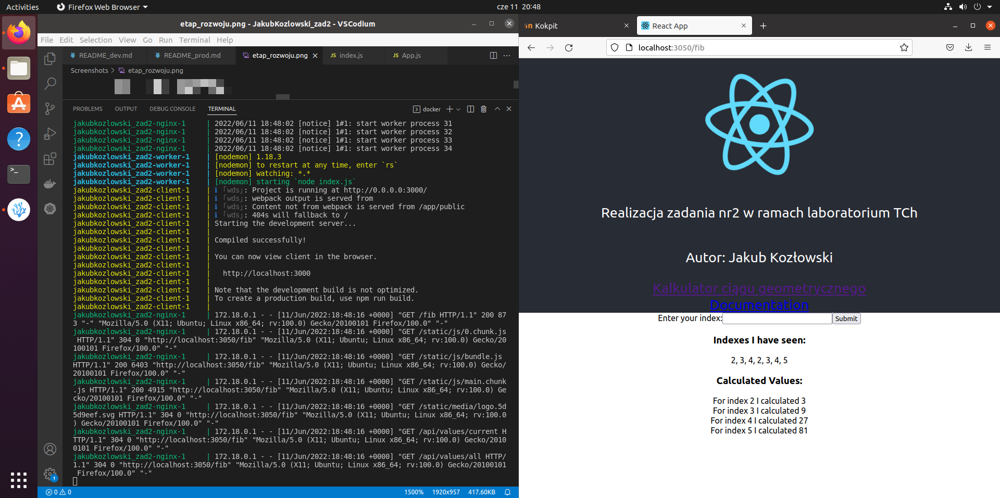

# Etap rozwoju

## Budowa obrazu w wersji rozwojowej
`docker compose -f docker-compose.dev.yml build`

## Uruchomienie usługi w wersji rozwojowej
`docker compose -f docker-compose.dev.yml up`

## Zrzut ekranu

Kontener client korzysta z serwera webpack.
