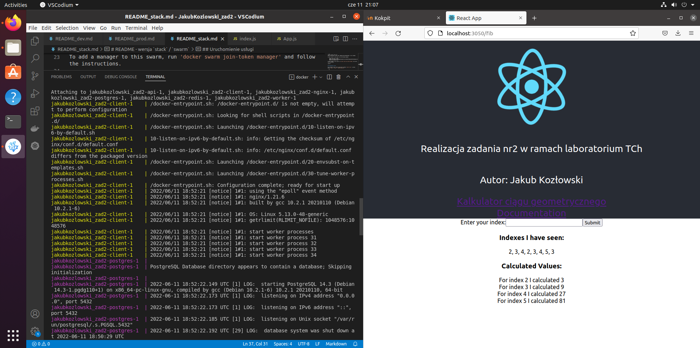

# Etap produkcyjny

## Przykładowa konfiguracja do budowy obrazu 
Do zbudowania obrazu należy skonfigurować plik .env
Przykładowy plik poniżej.
```sh
REGISTRY_ADDR='docker.io'
REGISTRY_USER='kybz'
IMAGE_NGINX='zad2:nginx'
IMAGE_API='zad2:api'
IMAGE_CLIENT='zad2:client'
IMAGE_WORKER='zad2:worker'
```

## Budowa obrazu w wersji produkcyjnej
`docker compose build`

## Przesłanie obrazu na DockerHub
`docker compose push`

## Uruchomienie usługi w wersji produkcyjnej
`docker compose up`

## Zrzut ekranu



kontener client wykorzystuje serwer nginx.
