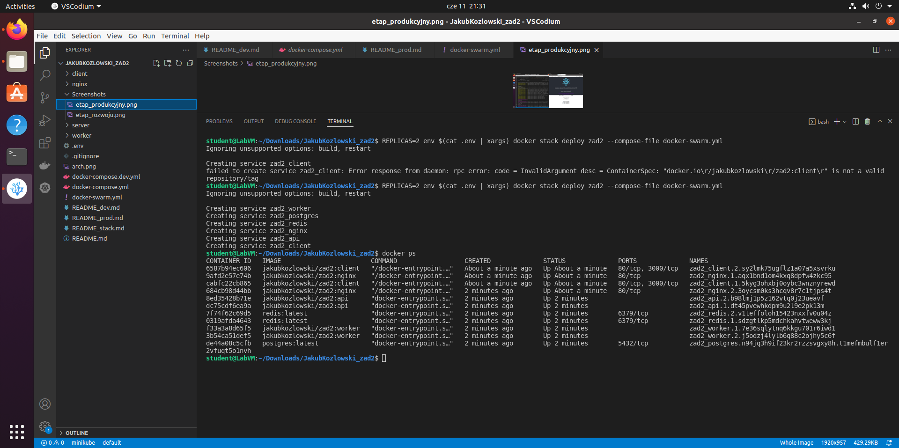

# Docker swarm

## Wczytywanie konfiguracji z pliku .env
`export $(cat .env | xargs)`

## Inicjalizacja klastra
`docker swarm init`

## Uruchomienie usługi
Za pomocą zmiennej środowiskowej `REPLICAS` ustalamy ilość replik.
`REPLICAS=2 env $(cat .env | xargs) docker stack deploy zad2 --compose-file docker-swarm.yml`

## Zrzut ekranu

